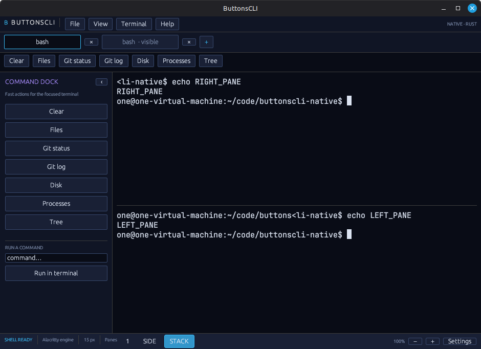

# ButtonsCLI Native

ButtonsCLI Native is a fast terminal workspace written in Rust. It uses a
native GPU-rendered UI and a production terminal state machine—no Tauri,
browser engine, DOM, or webview.



The desktop target is the product; the WebAssembly target is an intentionally
sandboxed interactive demo and never exposes a visitor's local shell.

Current desktop features include:

- real local shell sessions with production VT parsing and scrollback;
- native GPU-rendered tabs and single, side-by-side, or stacked pane layouts;
- keyboard input, live PTY resize, selection, copy, paste, and hyperlinks;
- a resizable command dock, quick command presets, and all 555 legacy theme
  selections with exact terminal ANSI palettes;
- 26 bundled font faces grouped into 19 selectable families, with independent
  typography for shell UI, tabs, dock, settings, assistant, status, and terminal,
  including separate terminal regular/bold faces;
- theme-driven terminal gradients, animated color drift, static, and scanline
  overlays rendered natively;
- persistent appearance preferences and clean child-process shutdown.

## Development

```sh
cargo run
```

The first build downloads and compiles the Rust dependency graph. Linux needs
the usual X11 or Wayland development packages. See `docs/BUILDING.md` for the
full platform notes.

Useful shortcuts are Ctrl+Shift+T (new tab), Ctrl+Shift+W (close tab),
Ctrl+Shift+C/V (copy/paste), Ctrl+Shift+, (Settings), and Ctrl+Shift+Q (quit).

Architecture decisions, verified behavior, and honest remaining gaps live in
`docs/ARCHITECTURE.md`, `docs/VERIFICATION.md`, and `docs/LIMITATIONS.md`.

The theme and font catalogs are embedded into the executable. They do not make
network requests and remain available offline.

## License

Dual-licensed under [MIT](LICENSE-MIT) or [Apache-2.0](LICENSE-APACHE), at your
option.
