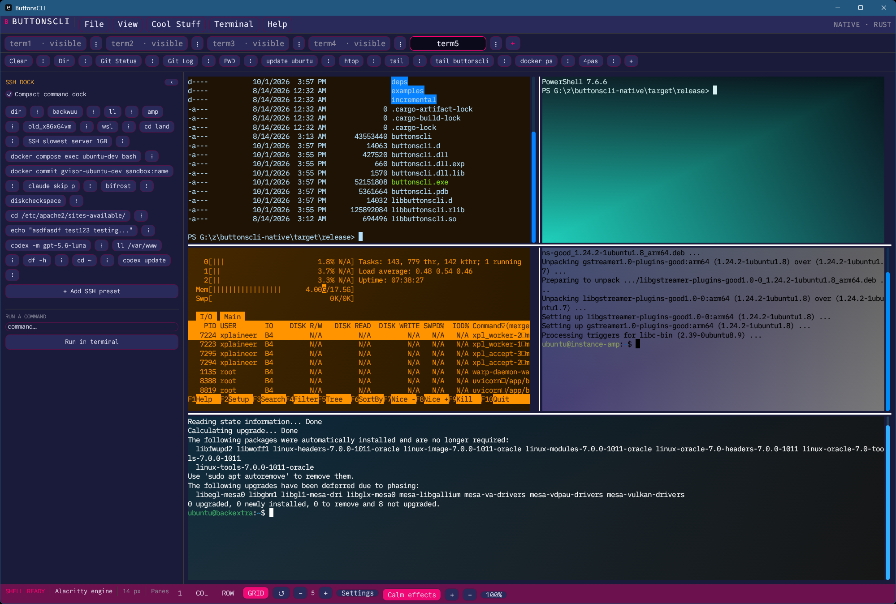
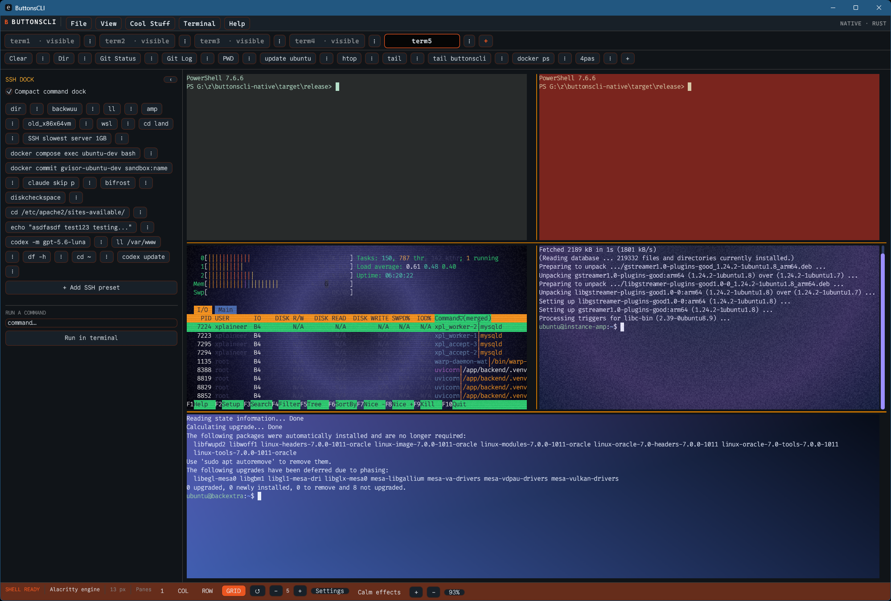

<div align="center">

# ButtonsCLI Native

**Your shells, your shortcuts, your workspace.**

A native terminal workspace built in Rust, with tiled shells, command buttons,
and hundreds of themes.

[](https://github.com/detroittommy879/buttonscli-native/actions/workflows/ci.yml)


[](#license)

[Get started](#get-started) · [Features](#what-you-can-do-today) · [Screenshots](#make-it-your-own) · [Current status](#current-status) · [Documentation](#documentation)

</div>



ButtonsCLI Native brings your terminal sessions and frequently used commands
into one configurable desktop workspace. Keep a local shell, remote SSH
sessions, build output, and a system monitor visible together; give each pane
its own theme and turn repeated commands into buttons. The UI uses egui/wgpu
and the terminal engine uses Alacritty through a vendored egui adapter.

**Usable as a terminal today, with more work ahead.** This is the native Rust
rebuild of [ButtonsCLI](https://buttonscli.com). AI Help is not ready for normal
use yet, and CLI/MCP agent control is currently available only through a debug
development override. See [current status](#current-status) for the details.

## What you can do today

| | In the app |
| --- | --- |
| **Work across shells** | Real local PTYs, shell profiles, working directories, PowerShell/CMD and Windows WSL choices. SSH runs through your chosen shell. |
| **Arrange your workspace** | Wrapping tabs, COL / ROW / GRID layouts, up to ten visible panes, draggable dividers, and per-tab auto-tile inclusion. Extra tabs keep their sessions running. |
| **Put commands on buttons** | Separate command and SSH docks with editable presets. Choose whether a button types the command or also sends Enter. Docks resize, collapse, and auto-hide. |
| **Use the terminal normally** | Scrollback and scrollbars, selection, copy/paste, hyperlinks, regex search, select-all, clear-screen, and live PTY resizing. |
| **Make every pane recognizable** | 555 bundled legacy theme choices, per-terminal themes, Theme all, favorites, and random-theme controls. Edit, import, and export personal theme JSON. |
| **Tune the look** | Offline bundled/system fonts, local TTF/OTF import, separate typography controls, gradients, scanlines and noise effects. Calm effects pauses motion; window opacity works on Windows. |
| **Keep settings separate** | Preferences live under `~/.buttonscli-native/`. Preview an import from the original app into a separate native profile. Provider keys transfer only when selected explicitly. |
| **Launch a workspace** | Start multiple tabs with a chosen shell/directory and optional commands for specific tabs. Startup options are available without AI or agent-control access. |

Right-click tabs, panes, or presets for their actions. Detached Settings previews
changes in the workspace and offers **Revert and Close**.

## Make it your own

The same workspace can use quiet solid colors, gradients, or supported terminal
effects. Each pane can keep a different theme.



<table>
  <tr>
    <th align="left">Personal themes</th>
    <th align="left">Fonts for each part of the app</th>
  </tr>
  <tr>
    <td width="50%"></td>
    <td width="50%"></td>
  </tr>
</table>

<sub>Screenshots captured on Windows in October 2026. They show customized
settings and live shell sessions; visible commands and remote connections are
examples from that workspace.</sub>

## Get started

Install a Rust toolchain and your platform's build prerequisites, then build
from source:

```sh
git clone https://github.com/detroittommy879/buttonscli-native.git
cd buttonscli-native
cargo run --locked --bin buttonscli
```

For an optimized desktop build:

```sh
cargo build --release --locked --bin buttonscli
```

Run `target/release/buttonscli.exe` on Windows, or
`./target/release/buttonscli` on Linux/macOS. The first build compiles the Rust
dependencies. The desktop app does not need Node; Node is used by the optional
CLI/MCP helpers. See [building notes](docs/BUILDING.md) for Linux packages and
the separate browser demo. Signed releases and automatic updates are still
unfinished.

To test gated features with your normal saved setup, use the
[local JSON feature flag](docs/LOCAL-FEATURE-FLAGS.md) and launch the executable
directly. This enables AI Help and other implemented gates in release builds.

**Open three PowerShell tabs and run a command in the first:**

```powershell
.\target\release\buttonscli.exe --tabs 3 --shell "pwsh -NoLogo -NoProfile" --command 1 "git status"
```

More shell, directory, and command options: [Launching a workspace](docs/STARTUP.md).

**Default shortcuts** — Primary is Ctrl on Windows/Linux and Command on macOS.

| Action | Shortcut |
| --- | --- |
| New / close / reopen tab | `Primary+Shift+T` / `Primary+Shift+W` / `Primary+Shift+U` |
| Copy / paste | `Primary+Shift+C` / `Primary+Shift+V` |
| Settings | `Primary+Shift+,` |
| Quit | `Primary+Shift+Q` |

Bindings can be edited or cleared in **Settings → Shortcuts**.

## Current status

The terminal workspace is the useful part of this build. Some optional features
have implementation and test coverage but are still locked or unfinished.

| Area | Status |
| --- | --- |
| **Terminal workspace** | Available now. Windows has live PTY/CLI checks; earlier Linux/X11 desktop evidence is recorded. Broader clipboard, focus, DPI, accessibility and platform review remains. |
| **AI Help** | Provider settings, streaming, optional terminal context and reviewed suggestions exist. An explicit local JSON override enables release testing with your normal profile. Broader real-provider and interaction acceptance remains open. |
| **CLI / MCP agent control** | Implemented with Windows live-app and contract tests. The local JSON override enables release access. All 14 MCP tools have fake-API coverage; this does not certify every tool in every agent client. |
| **AI theme generation** | Source implementation and provider tests exist. The local JSON override enables release access; interactive and broader provider/platform acceptance remains open. |
| **Effects / Shader Lab** | Supported gradients, scanlines, noise and analog static render natively. Legacy GLSL shaders do not run; Shader Lab, HSync warp and remaining effect work are unfinished. |
| **Accounts / distribution** | Hosted entitlement integration, production signing trust, updater activation and rollback still need work. The old feedback/runtime-config production paths are disabled pending a new native service. |

### Can an agent control it yet?

**Yes, for the paths covered by the tests, with development access or the local
JSON override enabled.** Agent control uses an authenticated API
bound to `127.0.0.1`, with an instance-specific connection file. Helpers can
create/rename tabs, arrange layouts, read output, send text or keys, and run
presets. **Agent Inst.** copies the connection instructions when control is enabled.

For development on Windows:

```powershell
$env:BUTTONSCLI_NATIVE_DEV_REMOTE_CONTROL = "1"
cargo run --locked --bin buttonscli
```

The override works only in debug builds. The API can send commands to real
shells, so connect a client you trust. Full setup, supported routes, and testing
limits are in [Native agent control](docs/CONTROL-API.md).

### What still needs to be done?

- Finish AI Help's real-provider, credential, focus/target and reviewed-action
  checks, plus the hosted access integration that unlocks release builds.
- Finish agent-control GUI handoff and broader MCP-client/tool acceptance,
  including Linux and macOS runtime checks.
- Complete signed release/update activation and rollback.
- Continue keyboard, clipboard, DPI, accessibility, IME and performance review
  across platforms; finish the remaining native effects and Shader Lab work.

Sessions are **not restored after an app restart**. Settings, presets, personal
themes and favorites persist; live shells and session-only theme choices do not.
For detailed boundaries, see [Current limitations](docs/LIMITATIONS.md) and the
[Verification record](docs/VERIFICATION.md).

## Documentation

| Start here | Customize and develop |
| --- | --- |
| [Native guide](docs/NATIVE-GUIDE.md) | [Personal themes](docs/PERSONAL-THEMES.md) · [Fonts](docs/FONTS.md) |
| [Workspace controls](docs/WORKSPACE-CONTROLS.md) | [Settings preview](docs/SETTINGS-PREVIEW.md) · [Window appearance](docs/WINDOW-APPEARANCE.md) |
| [Shell profiles](docs/SHELL-PROFILES.md) · [Startup](docs/STARTUP.md) | [AI Help](docs/AI-HELP.md) · [Control API / CLI / MCP](docs/CONTROL-API.md) |
| [Shortcuts](docs/SHORTCUTS.md) · [Terminal search](docs/TERMINAL-SEARCH.md) | [Architecture](docs/ARCHITECTURE.md) · [Contributing](CONTRIBUTING.md) |
| [Limitations](docs/LIMITATIONS.md) | [Verification](docs/VERIFICATION.md) · [Progress log](docs/PROGRESS.md) |

The separate WebAssembly demo uses a scripted terminal and cannot access a
visitor's local shell. The desktop build is the main app.

## License

Dual-licensed under [MIT](LICENSE-MIT) or [Apache-2.0](LICENSE-APACHE), at your option.
