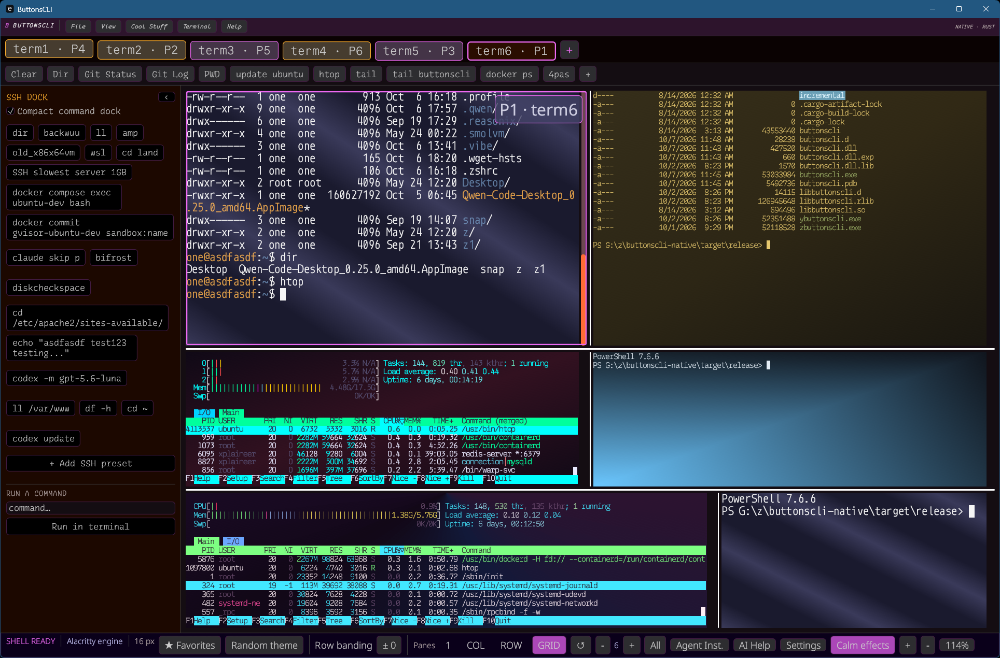
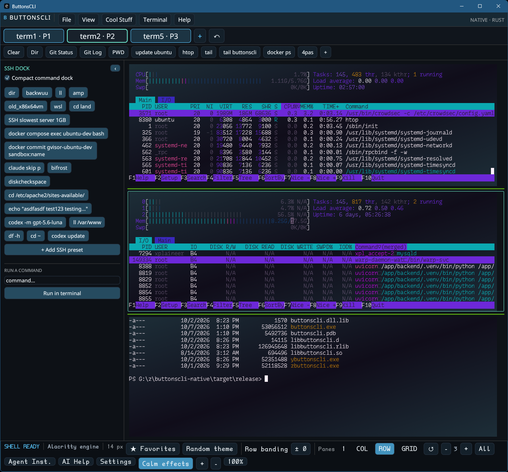
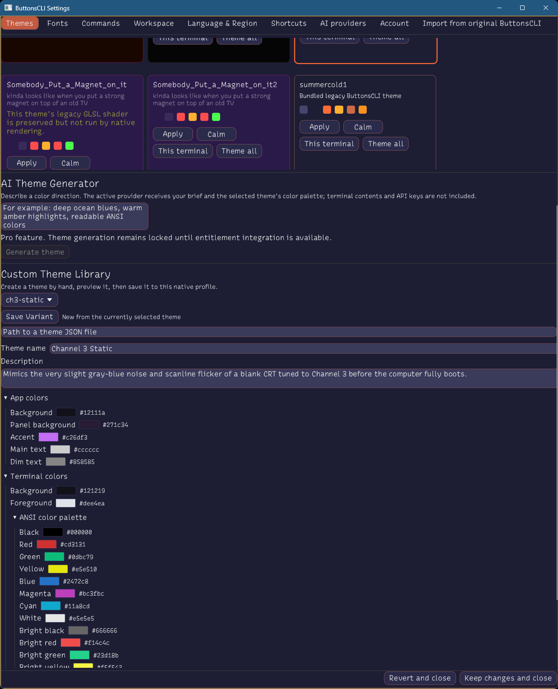
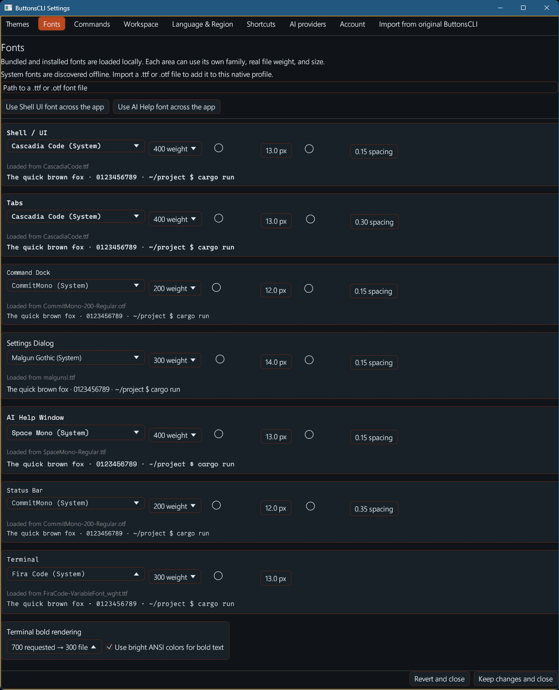

<div align="center">

# ButtonsCLI Native

**Your shells, your shortcuts, your workspace.**

A native terminal workspace built in Rust, with tiled shells, command buttons,
and hundreds of themes.

[](https://github.com/detroittommy879/buttonscli-native/actions/workflows/ci.yml)


[](#license)

[Get started](#get-started) · [Features](#what-you-can-do-today) · [Screenshots](#make-it-your-own) · [Current status](#current-status) · [Changelog](CHANGELOG.md)

</div>



ButtonsCLI Native brings your terminal sessions and frequently used commands
into one configurable desktop workspace. Keep a local shell, remote SSH
sessions, build output, and a system monitor visible together; give each pane
its own theme and turn repeated commands into buttons. The UI uses egui/wgpu
and the terminal engine uses Alacritty through a vendored egui adapter.

**Ready for daily terminal use on Windows.** This native Rust rebuild of
[ButtonsCLI](https://buttonscli.com) is used daily by its creator, who reports
that the core workflow is close to or on par with the original app. `main` is
the recommended stable source branch; clone or install from it for the latest
daily-use version. Optional AI and agent features remain previews. See
[current status](#current-status) and the [October 7 changelog](CHANGELOG.md).

## What you can do today

| | In the app |
| --- | --- |
| **Work across shells** | Real local PTYs, shell profiles, working directories, PowerShell/CMD and Windows WSL choices. SSH runs through your chosen shell. |
| **Arrange your workspace** | Wrapping tabs, COL / ROW / GRID layouts, up to ten visible panes, draggable dividers, and per-tab auto-tile inclusion. Extra tabs keep their sessions running. |
| **Put commands on buttons** | Separate command and SSH docks with editable presets. Choose whether a button types the command or also sends Enter. Docks resize, collapse, and auto-hide. |
| **Use the terminal normally** | Scrollback and scrollbars, selection, copy/paste, hyperlinks, regex search, select-all, clear-screen, and live PTY resizing. |
| **Make every pane recognizable** | 555 bundled legacy theme choices plus native themes, per-terminal themes/fonts, Theme all, favorites, and random-theme controls. Browse Library / Edit / Generate tabs; edit, import, and export personal theme JSON. |
| **Tune the look** | Offline bundled/system fonts, local TTF/OTF import, separate typography controls, gradients, scanlines and noise effects. Calm effects pauses motion; window opacity works on Windows. |
| **Keep settings separate** | Preferences live under `~/.buttonscli-native/`. Preview an import from the original app into a separate native profile. Provider keys transfer only when selected explicitly. |
| **Launch a workspace** | Start multiple tabs with a chosen shell/directory and optional commands for specific tabs. Startup options are available without AI or agent-control access. |

Right-click tabs, panes, or presets for their actions. Detached Settings previews
changes in the workspace and offers **Revert and Close**. You can keep typing
in the terminal while detached Settings is open. Matching pane numbers and tab
accents show where each session is displayed; switching tabs keeps shells alive.

## Make it your own

The same workspace can use quiet solid colors, gradients, or supported terminal
effects. Each pane can keep a different theme.



<table>
  <tr>
    <th align="left">Personal themes</th>
    <th align="left">Fonts for each part of the app</th>
  </tr>
  <tr>
    <td width="50%"></td>
    <td width="50%"></td>
  </tr>
</table>

<sub>Screenshots captured on Windows in October 2026. They show customized
settings and live shell sessions; visible commands and remote connections are
examples from that workspace.</sub>

## Get started

Install **current stable Rust**, Git and your platform's
[build prerequisites](docs/BUILDING.md). Install the recommended `main` version:

```sh
cargo install --git https://github.com/detroittommy879/buttonscli-native.git --branch main --locked --bin buttonscli
buttonscli
```

Repeat the install command to update. This builds the optimized desktop app
with its patched terminal dependencies and embedded themes/fonts. See
[Cargo installation](cargo-how-to.md) for details. To build from a checkout:

```sh
git clone --branch main https://github.com/detroittommy879/buttonscli-native.git
cd buttonscli-native
cargo run --locked --bin buttonscli
```

For an optimized desktop build:

```sh
cargo build --release --locked --bin buttonscli
```

Run `target/release/buttonscli.exe` on Windows, or
`./target/release/buttonscli` on Linux/macOS. The first build compiles the Rust
dependencies. The desktop app does not need Node; Node is used by the optional
CLI/MCP helpers. See [building notes](docs/BUILDING.md) for Linux packages and
the separate browser demo. Distribution is currently from source: downloadable
desktop releases, signing and automatic updates are still unfinished.

To test gated features with your normal saved setup, use the
[local JSON feature flag](docs/LOCAL-FEATURE-FLAGS.md) and launch the executable
directly. This enables AI Help and other implemented gates in release builds.

**Open three PowerShell tabs and run a command in the first:**

```powershell
.\target\release\buttonscli.exe --tabs 3 --shell "pwsh -NoLogo -NoProfile" --command 1 "git status"
```

More shell, directory, and command options: [Launching a workspace](docs/STARTUP.md).

**Default shortcuts** — Primary is Ctrl on Windows/Linux and Command on macOS.

| Action | Shortcut |
| --- | --- |
| New / close / reopen tab | `Primary+Shift+T` / `Primary+Shift+W` / `Primary+Shift+U` |
| Copy / paste | `Primary+Shift+C` / `Primary+Shift+V` |
| Settings | `Primary+Shift+,` |
| Quit | `Primary+Shift+Q` |

Bindings can be edited or cleared in **Settings → Shortcuts**.

## Current status

**Stable Windows core; optional features still in preview.** Readiness below is
for the stated workflow, not a promise of zero bugs or complete legacy parity.
“Complete” means the core feature is implemented and covered by Windows checks
and daily use. Approximate percentages are editorial progress estimates, not
test pass rates or reliability measurements. Updated October 7, 2026.

| Area | Readiness | What works / what remains |
| --- | --- | --- |
| **Shells, tabs and panes** | **Complete for the core Windows workflow** | Local PTYs, shell/WSL choices, SSH through a shell, COL / ROW / GRID, dividers, predictable tab replacement and independent input. Real Windows interaction probes pass. |
| **Commands and terminal tools** | **Complete for the core Windows workflow** | Command/SSH presets, selection, right-click or automatic copy, paste, scrolling, search and resizing. Terminal arrows/Tab/Escape stay with the shell; F6 moves to workspace controls. |
| **Themes, fonts and Settings** | **Complete for the core Windows workflow** | Per-tab appearance, favorites, personal JSON import/export, scoped preview/save, font tracking and detached Settings. Advanced theme collections and persistent tab assignment rules are proposals. |
| **AI Help** | **Working preview, roughly 70% ready** | Streaming, provider settings, optional context and reviewed actions work in fixture tests; real Mistral backend checks also passed. Broader real-provider GUI, accessibility and hosted access acceptance remain. |
| **CLI / MCP agent control** | **Working preview, roughly 70% ready** | Authenticated local API, live Windows CLI checks and 14-tool fake-API coverage. Full live tool/client coverage, GUI handoff and Linux/macOS acceptance remain. |
| **AI theme generation** | **Palette preview** | Validated palette drafts and provider tests exist. Full appearance generation with fonts/effects and native shaders is [planned](docs/AI-THEME-AND-SHADER-PLAN.md). |
| **Effects / Shader Lab** | **Supported effects work; shader work unfinished** | Gradients, scanlines, noise, row banding and analog static render natively. Legacy GLSL, Shader Lab and HSync warp do not run. |
| **Linux / macOS** | **Broader validation needed** | Linux build/tests and earlier X11 desktop checks exist; current Windows interaction evidence does not certify Linux/macOS. |
| **Accounts / installers / updates** | **Unfinished** | Git/source installation works. Hosted entitlement integration, downloadable releases, production signing, updater activation and rollback remain; old feedback/runtime-config services are disabled. |

AI Help, AI theme generation and CLI/MCP control require an explicit
[local feature flag](docs/LOCAL-FEATURE-FLAGS.md) for release testing. The core
terminal workspace does not need these features enabled. Agent Mode is a
separate unfinished prototype.

### Can an agent control it yet?

**Yes, for the paths covered by the tests, with development access or the local
JSON override enabled.** Agent control uses an authenticated API
bound to `127.0.0.1`, with an instance-specific connection file. Helpers can
create/rename tabs, arrange layouts, read output, send text or keys, and run
presets. **Agent Inst.** copies the connection instructions when control is enabled.

For development on Windows:

```powershell
$env:BUTTONSCLI_NATIVE_DEV_REMOTE_CONTROL = "1"
cargo run --locked --bin buttonscli
```

The override works only in debug builds. The API can send commands to real
shells, so connect a client you trust. Full setup, supported routes, and testing
limits are in [Native agent control](docs/CONTROL-API.md).

### What still needs to be done?

- Broaden AI Help's real-provider GUI and accessibility checks, and finish hosted
  access integration. Streaming/retry/cancel and reviewed-target routing already
  have isolated Windows fixture coverage.
- Finish agent-control GUI handoff and broader MCP-client/tool acceptance,
  including Linux and macOS runtime checks.
- Complete signed release/update activation and rollback.
- Continue keyboard, clipboard, DPI, accessibility, IME and performance review
  across platforms; finish the remaining native effects and Shader Lab work.

Sessions are **not restored after an app restart**. Settings, presets, personal
themes and favorites persist; live shells and session-only theme choices do not.
For detailed boundaries, see [Current limitations](docs/LIMITATIONS.md) and the
[Verification record](docs/VERIFICATION.md).

## Documentation

| Start here | Customize and develop |
| --- | --- |
| [Native guide](docs/NATIVE-GUIDE.md) | [Personal themes](docs/PERSONAL-THEMES.md) · [Fonts](docs/FONTS.md) |
| [Workspace controls](docs/WORKSPACE-CONTROLS.md) | [Settings preview](docs/SETTINGS-PREVIEW.md) · [Window appearance](docs/WINDOW-APPEARANCE.md) |
| [Shell profiles](docs/SHELL-PROFILES.md) · [Startup](docs/STARTUP.md) | [AI Help](docs/AI-HELP.md) · [Control API / CLI / MCP](docs/CONTROL-API.md) |
| [Shortcuts](docs/SHORTCUTS.md) · [Terminal search](docs/TERMINAL-SEARCH.md) | [Architecture](docs/ARCHITECTURE.md) · [Contributing](CONTRIBUTING.md) |
| [Limitations](docs/LIMITATIONS.md) | [Verification](docs/VERIFICATION.md) · [Progress log](docs/PROGRESS.md) |

The separate WebAssembly demo uses a scripted terminal and cannot access a
visitor's local shell. The desktop build is the main app.

## License

Dual-licensed under [MIT](LICENSE-MIT) or [Apache-2.0](LICENSE-APACHE), at your option.
