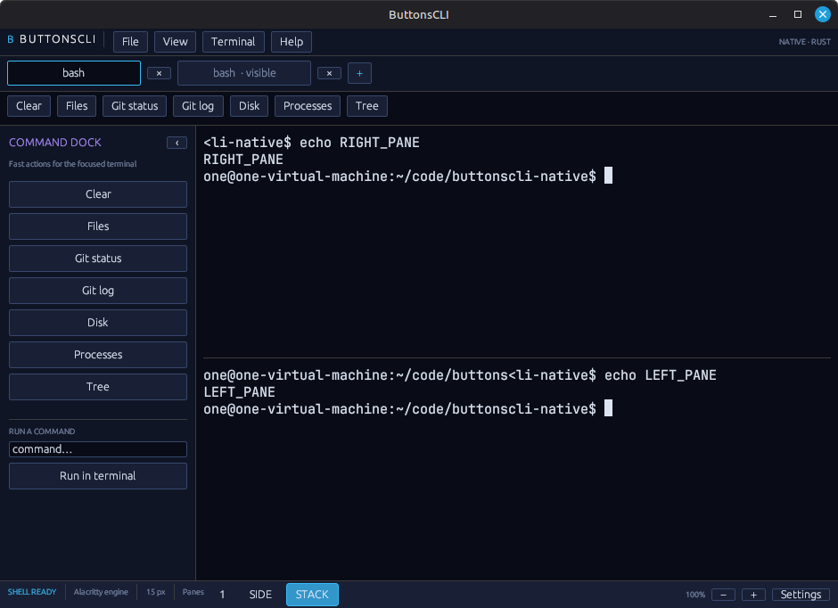

# ButtonsCLI Native

ButtonsCLI Native is a fast terminal workspace written in Rust. It uses a
native GPU-rendered UI and a production terminal state machine—no Tauri,
browser engine, DOM, or webview.



The desktop target is the product; the WebAssembly target is an intentionally
sandboxed interactive demo and never exposes a visitor's local shell.

Current desktop features include:

- real local shell sessions with production VT parsing, scrollback, and a
  draggable per-terminal scrollbar when retained history exists;
- native GPU-rendered tabs that wrap into more rows, and draggable COL, ROW,
  and GRID layouts for up to ten terminal panes; panes wrap when space is tight,
  with the focused session visible and all tabs reachable from the strip;
- always visible pane dividers with theme inheritance or a saved custom color
  and painted width, plus a saved corner-radius control for tabs and chrome;
- new tabs named `term1`, `term2`, and so on, with rename, reorder, and
  recent-close recovery with pane-safe index updates;
- detected and custom shell profiles with persisted default/per-tab selection,
  quoted arguments, working directories, and Windows WSL distribution choices;
- keyboard input, live PTY resize, selection, copy, paste, and hyperlinks;
- focused-terminal regex search across wrapped text and scrollback, plus
  select-all and clear-screen actions that leave the shell running;
- a resizable compact command dock with auto-hide and a status-bar terminal
  zoom readout, reset action, and quick calm-effects switch;
- detached Settings with live preview and a Revert & Close action, with an
  in-window fallback when the platform cannot create another viewport;
- separate command and SSH docks, editable persisted presets with type/run
  behavior, all 555 bundled legacy theme selections, and personal version 1
  theme JSON files from the active native profile's `themes/` folder;
- editable AI provider endpoints and model IDs, plus a separate AI Help window
  with streamed answers, previewed optional terminal context, and explicitly
  reviewed suggestions; the Pro gate is still closed in release builds until
  native entitlement integration exists;
- an authenticated, loopback-only agent control API with an **Agent Inst.**
  handoff, optional Node CLI, and optional stdio MCP server; it supports tab
  creation, rename, layouts, presets, bounded output reads, and raw, bracketed,
  or paced input, but is still Pro-gated and not enabled in release builds;
- 26 bundled font faces grouped into 19 selectable families, with independent
  typography for shell UI, tabs, dock, settings, assistant, status, and terminal,
  including separate terminal regular/bold faces;
- theme-driven linear, radial, and conic terminal gradients, animated color
  drift, static, and scanline overlays rendered natively;
- per-terminal theme choices plus **Theme all**, **Random current**, and
  **Random all** in Theme Settings; the tab hover shows its current theme;
- persistent appearance preferences and clean child-process shutdown.

## Development

```sh
cargo run
```

The first build downloads and compiles the Rust dependency graph. Linux needs
the usual X11 or Wayland development packages. See `docs/BUILDING.md` for the
full platform notes.

Default shortcuts are `Primary+Shift+T` (new tab), `Primary+Shift+W` (close),
`Primary+Shift+U` (reopen), `Primary+Shift+C/V` (copy/paste),
`Primary+Shift+,` (Settings), and `Primary+Shift+Q` (quit). Primary means Ctrl
on Windows/Linux and Command on macOS. Edit or clear these under
**Settings → Shortcuts**; see [Keyboard shortcuts](docs/SHORTCUTS.md).

See [Terminal search and buffer actions](docs/TERMINAL-SEARCH.md) for search,
select-all, and clear-screen behavior.

See [Workspace controls](docs/WORKSPACE-CONTROLS.md) for dock auto-hide,
terminal zoom, and the calm-effects toggle.

See [Settings preview](docs/SETTINGS-PREVIEW.md) for the detached window,
rollback behavior, and current platform checks.

New tab numbers increase within each app run. Closing or reopening a tab does
not reuse its number; restarting begins at `term1` because sessions are not
restored. A custom tab name survives reorder and recent-close recovery. Shell
names and terminal-reported titles do not replace the tab name automatically.

Desktop preferences now save under `~/.buttonscli-native/`. If no native settings
document exists, the app reads its earlier eframe preferences once and writes a
native copy on the next save. The original Tauri app's `~/.buttonscli/` folder is
not changed. On desktop, open **Settings → Import from original ButtonsCLI** to
preview the active original profile or select another listed profile. Confirming
creates a separate native profile with settings, command and SSH presets, and
valid personal themes. Repeating the same snapshot preserves native edits;
changed source data creates another profile. Import never runs saved commands.
API keys, runtime/auth files and session history are excluded. Provider names,
endpoints and models are retained as inert compatibility data and can be edited
under **Settings → AI providers**. Keys can be saved in the operating system's
credential store or kept for the current session.

Personal themes are read when the desktop app starts. A broken theme file is
skipped without removing other themes. Imported files are copied only after
confirmation; unsupported effect fields are retained for later export but are
not rendered.

In Theme Settings, **This terminal** pins a theme to the focused session;
**Use global** returns it to the saved default. **Theme all** changes that
default and replaces every open session's override, including hidden tabs.
Random controls avoid repeating a terminal's current theme when another is
available. Per-terminal choices survive tab reorder and recent-close recovery,
but reset after app restart because terminal sessions are not restored.

Architecture decisions, verified behavior, and honest remaining gaps live in
`docs/ARCHITECTURE.md`, `docs/VERIFICATION.md`, and `docs/LIMITATIONS.md`.

See [`docs/AI-HELP.md`](docs/AI-HELP.md) for provider and review behavior, and
[`docs/CONTROL-API.md`](docs/CONTROL-API.md) for the native agent-control
handoff, supported routes, and current access limits.

The [feature migration plan](docs/migration/README.md) compares the original
Tauri app with this native implementation, records source/build evidence for
completed work, and tracks remaining platform and acceptance checks.

The theme and font catalogs are embedded into the executable. They do not make
network requests and remain available offline.

Choose a display language or follow the operating system in **Settings →
Language & Region**. A first-run chooser appears only for a new install. See
[`docs/LOCALIZATION.md`](docs/LOCALIZATION.md) for supported languages and
current font and layout limits.

## License

Dual-licensed under [MIT](LICENSE-MIT) or [Apache-2.0](LICENSE-APACHE), at your
option.
